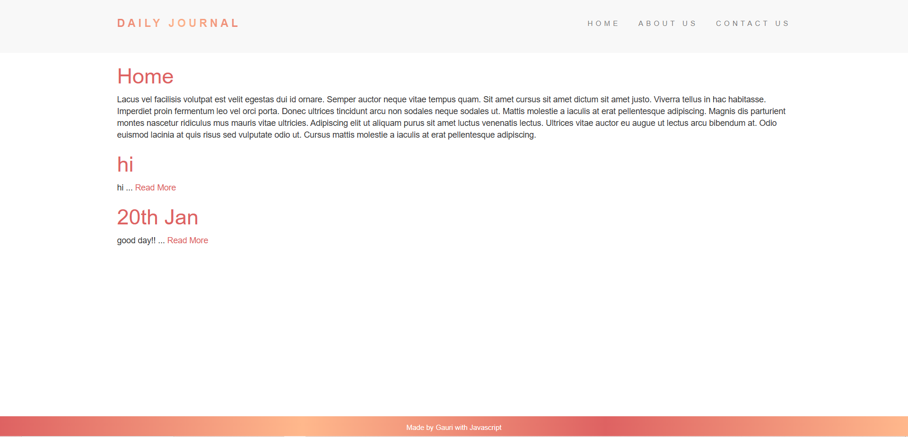
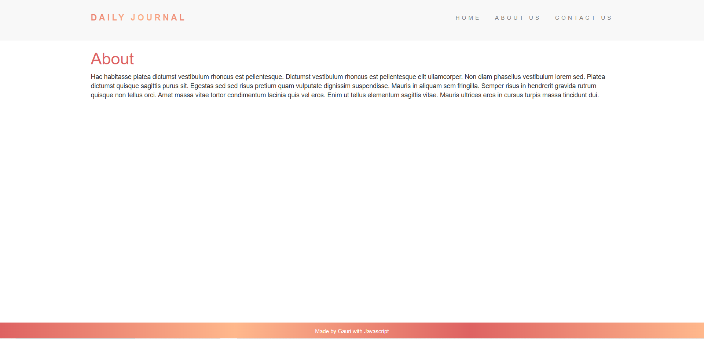
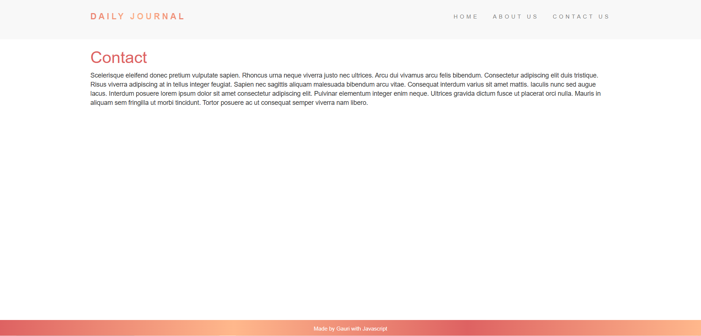
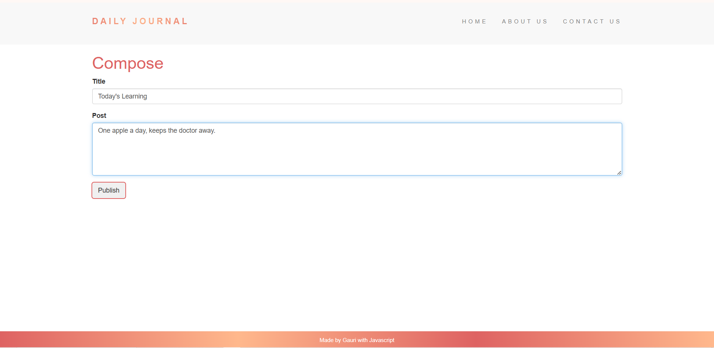

## Overview
A simple and modern Blog Website built with HTML, CSS, and JavaScript. This project serves as a platform where users can view blog posts, explore content categories, and interact with different posts in a clean, user-friendly design.

## Features
- Responsive Design: The website is fully responsive, meaning it works seamlessly on both mobile and desktop devices.
- Dynamic Blog Posts: Displays various blog posts with a title, content, and images.
- Navigation: Simple navigation for easy access to different blog categories and posts.
- CSS Animations: Smooth animations for a better user experience.

## Endpoints
### Get All Posts
- **URL:** `/`
- **Method:** GET
- **Description:** Retrieve a list of all blog posts.

### Get About Page
- **URL:** `/about`
- **Method:** GET
- **Description:** Retrieve the content of the about page.

### Get Contact Page
- **URL:** `/contact`
- **Method:** GET
- **Description:** Retrieve the content of the contact page.

### Get Compose Page
- **URL:** `/compose2022`
- **Method:** GET
- **Description:** Retrieve the compose page where users can create new posts.

### Create Post
- **URL:** `/compose2022`
- **Method:** POST
- **Description:** Create a new blog post.

## UI Structure
The UI consists of the following main components:
- **Post List:** Displays a list of all Posts.



- **About Page:** Displays information about the website.



- **Contact Us Page:** Displays information for users to get in touch with the website administrators.



- **Post Form:** A form for creating Posts.



## Installation
1. Clone the repository:
     ```bash
     git clone https://github.com/yourusername/blog_website.git
     ```
2. Navigate to the project directory:
     ```bash
     cd blog_website
     ```To run this project locally, follow the steps below:
3. Open the index.html file in your browser to view the website.
